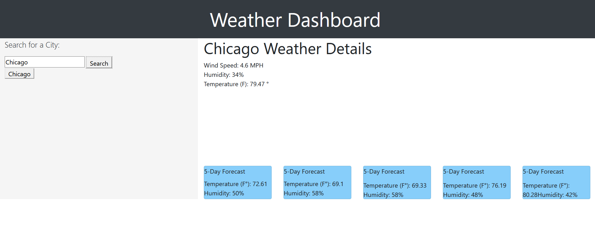

# homework-6-interactive-calendar
# Refactoring an HTML File Following Accessibility Standards.

## The Repository

This repository consists of a simple HTML file that has created a dynamic daily planner.

## Table of Contents 

* [Installation](#installation)
* [Usage](#usage)
* [Credits](#credits)
* [MIT License](#mit_license)

## Installation

Clone the repository found at:

https://github.com/brw1820/homework-6-interactive-calendar

https://brw1820.github.io/homework-6-interactive-calendar/

Proceed to run the index.html file in your browser.  Once loaded, you input activities into your schedule and save them to local storage by hitting the floppy disk button.

## Usage 

This HTML file provides a work day scheduler to the user.

## Credits

The provided work was a solo project created as homework for Georgia Tech, Fullstack Flex program.

## License

MIT License

Copyright (c) [2020] [Brian R. Warner]

Permission is hereby granted, free of charge, to any person obtaining a copy
of this software and associated documentation files (the "Software"), to deal
in the Software without restriction, including without limitation the rights
to use, copy, modify, merge, publish, distribute, sublicense, and/or sell
copies of the Software, and to permit persons to whom the Software is
furnished to do so, subject to the following conditions:

The above copyright notice and this permission notice shall be included in all
copies or substantial portions of the Software.

THE SOFTWARE IS PROVIDED "AS IS", WITHOUT WARRANTY OF ANY KIND, EXPRESS OR
IMPLIED, INCLUDING BUT NOT LIMITED TO THE WARRANTIES OF MERCHANTABILITY,
FITNESS FOR A PARTICULAR PURPOSE AND NONINFRINGEMENT. IN NO EVENT SHALL THE
AUTHORS OR COPYRIGHT HOLDERS BE LIABLE FOR ANY CLAIM, DAMAGES OR OTHER
LIABILITY, WHETHER IN AN ACTION OF CONTRACT, TORT OR OTHERWISE, ARISING FROM,
OUT OF OR IN CONNECTION WITH THE SOFTWARE OR THE USE OR OTHER DEALINGS IN THE
SOFTWARE.